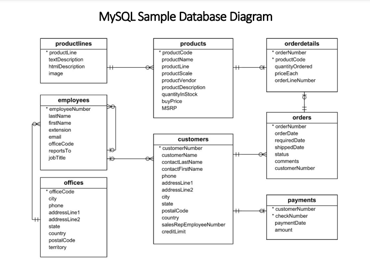

# SQL Project: Classis Models Analysis


## Description

This project uses SQL to analyze the dataset of an Classis Models. The goal of the project is to answer a set of questions about the customer and their relative order performance and help in getting insights in it.

## Installation

To run this project on your machine you need to install any SQL-supported DBMS then follow the steps below:
1. Create a database by running this <a href="https://github.com/gkteja/Classis-Models-Analysis/blob/main/classicmodelsdb.sql">file</a> in your local SQL editor. 


## Schema Diagram


<!-- ## Usage

Provide instructions and examples for use. Include screenshots as needed.

To add a screenshot, create an `assets/images` folder in your repository and upload your screenshot to it. Then, using the relative filepath, add it to your README using the following syntax:

    ```md
    
    ``` -->

## Database and Tools

* MySQL

## License

You can use this dataset to build your own project and practice your SQL skills.

---


## Questions Answered

The following are a few of the questions that are answered in the project (check out <a href="https://github.com/gkteja/Classis-Models-Analysis/blob/main/SQL_Analysis_ClassicModels.sql">SQL_Analysis_ClassicModels.sql</a> file for the rest):

* Calculate the average order amount for each country
* List the top 10 best-selling products based on total quantity sold
* Evaluate the sales performance of each sales representative
* Calculate the average number of orders placed by each customer
* Identify frequently co-purchased products to understand cross-selling opportunities

## Results

Please find the results here <a href="https://github.com/gkteja/Classis-Models-Analysis/blob/main/SQL_Analysis_ClassicModels.sql">SQL_Analysis_ClassicModels.sql</a>

## Conclusion

This project effectively demonstrats the power of SQL in analyzing and extracting valuable insights from a complex dataset. The insights gained through this analysis can contribute to improved customer satisfaction and overall business performance.


<!--## How to Contribute

If you created an application or package and would like other developers to contribute it, you can include guidelines for how to do so. The [Contributor Covenant](https://www.contributor-covenant.org/) is an industry standard, but you can always write your own if you'd prefer.-->


<!-- ## Conclusion

This project effectively demonstrats the power of SQL in analyzing and extracting valuable insights from a complex dataset. The insights gained through this analysis can contribute to improved customer satisfaction and overall business performance.


I hope this is helpful! -->
